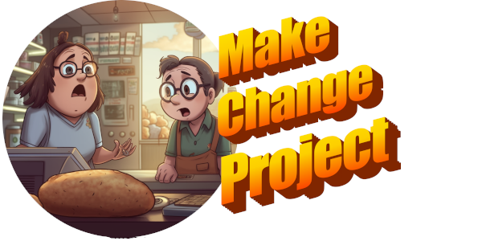
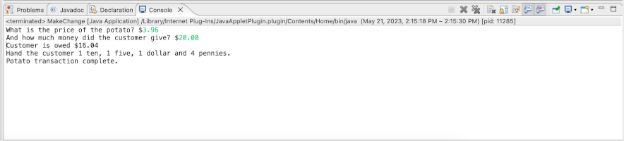

# MakeChangeProject

Week 1 homework project by Justin Martz

## Table of contents

- [Overview](#overview)
	- [The assignment](#the-assignment)
	- [Screenshot](#screenshot)
- [My process](#my-process)
	- [Technologies used](#technologies-used)
	- [What I learned](#what-i-learned)

## Overview

### The assignment

In the cash register we will calculate the amount of change returned to a customer based on the purchase price and the amount tendered. We will also notify the attendant how many of each piece of currency ($20 ,$10 ,$5 ,$1, .25c, .10c, .05c, .01c) is needed to make the change for the customer. Change should be provided using the largest bill and coin denominations as possible. Denominations that are not used should not be displayed.

### Screenshot

## My process

### Technologies used

- Java
- Eclipse

### What I learned

I learned some quirks about typecasting inside a printf() method. I wanted formatted output to show only two decimal places and got that result. However, I thought that what was sent to the screen was the same as what was in the variable changeOwed, and it was not. That was a funny little bug to track down. I fixed it by adding .001 to changeOwed before I typecast it.

I also got to apply some extensive use of logical operators and precedence in this assignment.

I know this submission is an abomination of if-else statements, and probably way too many variables than what are needed, but it works!
